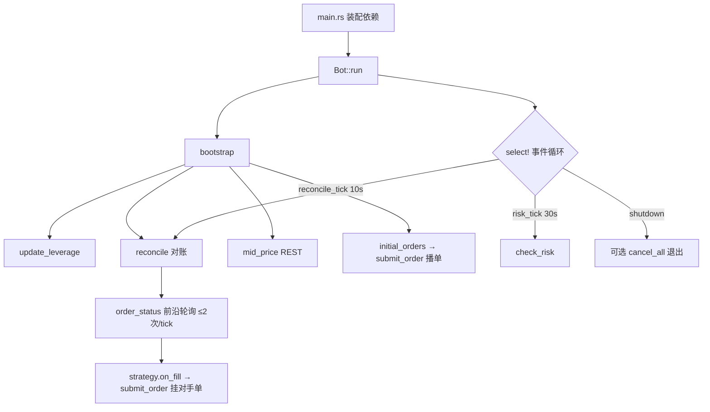

# AGENTS.md — hyperbot 工程逻辑参考

> 面向维护者 / AI agent 的**完整逻辑说明与排错备忘**。目的：理解整个系统后再改动，
> 避免反复引入同类 bug。用户文档见 [README.md](README.md)；本文件聚焦实现细节、
> 不变量（invariants）和历史踩坑。

## 1. 系统总览

合约（永续）网格交易 Bot。事件驱动、单事件循环（`Bot::run`）编排以下模块：

| 模块 | 文件 | 职责 |
| --- | --- | --- |
| `config` | [src/config.rs](src/config.rs) | 加载 `config.toml`，敏感字段从环境变量注入并校验 |
| `telemetry` | [src/telemetry.rs](src/telemetry.rs) | `tracing` 结构化日志 |
| `exchange` | [src/exchange/mod.rs](src/exchange/mod.rs) | `Exchange` trait 抽象；`HyperliquidExchange` 实盘 + `MockExchange` 测试 |
| `grid` | [src/grid/mod.rs](src/grid/mod.rs) | **纯逻辑**网格策略，无 I/O，完整单测 |
| `store` | [src/store/mod.rs](src/store/mod.rs) | `sqlx` + PostgreSQL 持久化 |
| `risk` | [src/risk.rs](src/risk.rs) | 风控熔断 |
| `bot` | [src/bot/mod.rs](src/bot/mod.rs) | 事件循环编排 |

## 2. 数据流与生命周期



### 关键不变量

- **纯轮询，无 websocket**：成交检测只有两条来源——下单立即成交（`place_order` 同步返回
  `resting=false`）与**每 10s 周期 `reconcile`** 对前沿订单调用 `order_status`。
  没有实时推送；成交最长延迟一个轮询周期（10s）才被发现并补挂对手单。
- **事件循环单线程串行**：`Bot::run` 的 `tokio::select!` 同一时刻只执行一个分支并跑到
  完成，周期 `reconcile` / `check_risk` **不会并发**。因此它们之间没有
  数据竞争，`place_and_persist`（insert→place→mark_open）一定在分支内原子完成，周期
  reconcile 永远不会看到"在 DB 里还是 pending、但已在交易所挂上"的中间态订单。
- **订单状态机（DB）**：`pending`（已插库未确认）→ `open`（交易所已挂单，记录 `exchange_oid`）
  → `filled` / `cancelled`。状态字符串见 `OrderStatus::as_str`。
- **订单状态（交易所层）**：`Exchange::order_status` 返回 `OrderState`，有四种值：
  `Open`（未成交）、`PartialFill`（部分成交仍挂单）、`Filled`（完全成交）、`Cancelled`（已撤或未知）。
- **网格档位（level）**：`levels` 是升序的 `grid_count + 1` 条价格线。`level` 是索引。

## 3. 网格策略（grid，纯逻辑）

三种方向共享同一思路：启动时在相关网格线预埋**开仓单**，由 `Bot` 依据中间价决定该单是
**挂单（resting）**还是**越过盘口立即成交（crossing）**；成交即开仓，随后挂对应**止盈对手单**。

- **short_only**：除最低线外每条线挂卖单（开空）；成交后在**下一档**挂 `reduce_only` 买单
  止盈；该买单成交后在原档**重挂卖单**。净持仓恒 ≤ 0。
- **long_only**（short_only 镜像）：除最高线外每条线挂买单（开多）；成交后在**上一档**挂
  `reduce_only` 卖单止盈；该卖单成交后在原档重挂买单。净持仓恒 ≥ 0。
- **neutral**：中间价下方挂买、上方挂卖；买单成交后在上一档挂卖，卖单成交后在下一档挂买；
  对手单**不使用** `reduce_only`（持仓可正可负）。

实现入口：`GridStrategy::initial_orders(mid, active_levels)` 与 `GridStrategy::on_fill(level, side)`。

## 4. 下单与成交流转（bot）

### `submit_order(order, mid)`

广度优先处理一条 desired order 及其立即成交引发的级联对手单（上限 `MAX_FOLLOWUPS = 64`）：

1. `should_skip`：跳过会重复已挂腿的单（同 level+side 已挂；或重启后仓位已开的开仓单）。
2. 判断是否 crossing：`Sell` 当 `price <= mid`、`Buy` 当 `price >= mid` 为越价单，按 `mid` 价挂；
   否则按网格价挂。
3. `place_and_persist`：insert(pending) → `exchange.place_order` → `mark_open(oid)`。
4. **若交易所返回 `resting == false`（立即成交）**：记录 fill、置 `Filled`、把 `on_fill` 的对手单
   入队继续级联。
5. **若 `resting == true`**：留在盘口，等待下一次周期 reconcile 检测其成交。

### `reconcile()` —— REST 对账，启动时 + **每 10s 周期**调用（唯一成交检测路径）

执行步骤：

1. **孤儿撤单**：取消交易所上存在但 DB 中不再跟踪的订单（只撤盘口上实际存在的单，快照不全也安全）。
2. **前沿轮询（卖单）**：将 DB 中所有 `open` 状态的卖单按**价格升序**排列（最低价先成交）；
   依次对每单调用 `order_status`，遇到以下情况则停止：
   - `Open` / `PartialFill`：前沿未完全成交 → 更高档位肯定也未成交，终止扫描。
     `PartialFill` 时额外打印 `warn!` 日志等待全量成交。
   - `Cancelled`：标记 DB 为 `cancelled`，继续检查下一单（被撤不代表更高档已成交）。
   - `Filled`：`record_fill` → 置 `Filled` → `on_fill` 对手单经 `submit_order` 挂出，继续检查下一单。
3. **前沿轮询（买单）**：将 DB 中所有 `open` 状态的买单按**价格降序**排列（最高价先成交），
   对称执行同样逻辑。
4. 返回仍在盘口的 level 集合，供 `initial_orders` 去重。

**每 tick 最多调用 2 次 `order_status`**（卖单前沿 1 次 + 买单前沿 1 次，稳态下即止）。

> **前沿不变量（核心设计依据）**：
> - 卖单：价格升高才成交 → 最低价卖单最先成交。若最低价卖单是 `Open/PartialFill`，更高价格的卖单一定仍在盘口。
> - 买单：价格下降才成交 → 最高价买单最先成交。同理若最高价买单是 `Open/PartialFill`，更低价格的买单一定仍在盘口。
> - 因此每侧只需从前沿往后扫描，遇到首个 `Open/PartialFill` 即可终止。

## 5. 成交检测（前沿轮询）与历史踩坑（重要！）

**策略：无 websocket，纯轮询。** 成交信息只有两条来源：

1. **立即成交**：`place_order` 同步返回 `resting=false`，在 `submit_order` 内即时处理。
2. **REST 周期对账**：每 10s `reconcile` 对**前沿订单**调用 `order_status`，每侧最多 1 次 API 调用。

> **设计取舍**：放弃 websocket 后，成交检测延迟从「近实时」变为「最长 10s」。前沿轮询的
> API 调用数与网格档位数无关（每侧恒为 ≤1 次），从根本上解决了旧方案的限流风险；换来的
> 是更简单、更健壮的代码（无长连接、重连、快照去重等复杂性）。

### 踩坑 1：用「盘口消失」推断成交会引发灾难（根因事故）

旧 reconcile 把「DB 里 `open` 但已从交易所盘口消失」的订单一律判为**已成交**。真实交易所的
`open_orders` 会因限流 / 最终一致性短暂返回**空或不全**，一旦如此，**全部** `open` 订单被误判为
成交 → 触发海量 `reduce_only` 对手单 → 仓位不足被交易所拒单 → 大批 `cancelled`。这是一次
严重事故的根因。→ 修复：reconcile 改对每个前沿订单单独调用 `order_status`（交易所权威单笔查询），
只对确实 `Filled` 的 oid 落地；盘口快照不全只会少撤孤儿单，绝不会虚构成交。

> ⚠️ 永远不要用「订单不在盘口 == 已成交」推断成交。成交必须来自 `order_status` 的权威返回。

### 踩坑 2：批量拉取成交历史（`recent_fills`）—— 已废弃，勿重新引入

旧方案调用 `recent_fills`（HL 为 `user_fills`）拉取全部成交历史，需要一个"水位线"
（watermark）来去重已处理成交；水位线维护容易出现漂移导致重复或遗漏，且拉取的历史数据
量随时间增长。新方案改用每单独立的 `order_status` 查询，彻底消除水位线逻辑。

> 📜 历史注：本项目曾试图用 websocket 推送成交，踩过两个坑：订阅错频道（`userEvents` 不含
> 成交，应为 `userFills`）、`is_snapshot` 快照需跳过以免重复记账。现已**彻底移除 websocket**，
> 改为纯轮询，这些复杂性随之消失。若未来重新引入实时推送，请务必用 `userFills` 而非
> `userEvents`，并保留周期 reconcile 作为兜底。

## 6. Hyperliquid 价格/数量精度（tick & lot，已修复）

**症状**：`order rejected: Price must be divisible by tick size`。

Hyperliquid 对每个永续合约有精度规则：价格最多 **5 位有效数字**，小数位最多
`6 - sz_decimals` 位；数量小数位最多 `sz_decimals` 位。网格等差算出的价格小数位常常超限。

→ 修复：`HyperliquidExchange` 保存完整的 `PerpMarket`（`coin_to_market`，含 tick 表与
`sz_decimals`），下单前用 `market.round_price(..)` 对齐价格、`round_dp(sz_decimals)` 对齐数量。
见 [src/exchange/hyperliquid.rs](src/exchange/hyperliquid.rs) 的 `place_order`。

> ⚠️ 不要直接把网格原始 `f64` 价格塞给 `OrderRequest`，必须先经 `round_price`。
> DB 里存的是对齐前的网格价（仅展示用），对账靠 `exchange_oid` 而非价格，不受影响。

## 7. 持久化（store / PostgreSQL）

- 运行时（非编译时）`sqlx` 查询，故无需 live DB 即可编译。
- 表：`grid_orders`（唯一索引 `exchange_oid`）、`fills`（追加）、`position_snapshots`。
- 迁移 [migrations/0001_init.sql](migrations/0001_init.sql) 经 `sqlx::migrate!` 内嵌，启动时执行。
- 成交对账靠 `order_by_exchange_oid`（`oid: u64` 以 `i64` 存取，HL oid 落在 i64 范围内）。

## 8. 已知简化（非 bug，刻意为之）

- **部分成交（PartialFill）**：`reconcile` 遇到 `OrderState::PartialFill` 时只打印 `warn!`
  日志，**不**提前挂对手单，等待前沿订单完全成交再处理。对网格（每档定量、小单）绝大多
  数情况一次成交完毕；部分成交时前沿停止扫描（更高档位仍安全），待下一轮 reconcile 继续
  检测全量成交。DB 中不新增 `partial` 状态字段，避免迁移与过度设计。
- **成交延迟最长 10s**：无实时推送，挂单成交最多等一个轮询周期才被发现、补挂对手单。
  对网格这类非高频策略可接受；若 10s 内价格穿过多档，对手单会在下一轮按当时 mid 补挂
  （可能略有滑点），但不影响正确性。
- **被拒的止盈单**：若 `reduce_only` 对手单被交易所拒（置 `cancelled`），该开仓单会暂时无止盈腿。
  由于周期 reconcile 在**仓位已结算**后才挂对手单（用当前 mid），拒单概率极低；真发生时需人
  工关注。暂不做「期望态 vs 实际态」的全量差异重构。

## 9. 改动前必读 checklist

- [ ] 成交来源只有两条（立即成交 / 每 10s 周期 reconcile 前沿轮询）；动其一前确认另一条仍成立。
- [ ] 不要用「订单不在盘口 == 已成交」推断成交；成交只能来自 `order_status` 权威返回或 `place_order` 同步返回。
- [ ] 不要重新引入 `recent_fills` 批量成交历史；`order_status` 前沿轮询每 tick 最多 2 次 API 调用，更低限流风险。
- [ ] 前沿不变量：卖单按价格升序、买单按价格降序迭代；首个 `Open`/`PartialFill` 即终止扫描。改动排序或终止条件时需重新验证。
- [ ] `PartialFill` 只打 warn 不触发对手单，等待全量成交；若要改为立即出对手单，需注意超额平仓风险。
- [ ] 任何下单价格/数量必须经交易所精度对齐。
- [ ] 依赖「`select!` 串行、无并发」这一不变量；若引入并发分支，需重新审视 reconcile 与
      `place_and_persist` 的竞态。
- [ ] 集成测试共用同一 DB 且 `make_store` 会清表，必须串行跑：`cargo test --test grid_flow -- --test-threads=1`。
- [ ] 改完跑 `make test`（纯逻辑，无需 DB）与 `make clippy`。

## 10. 构建 / 测试

```bash
make build      # 编译
make test       # 单测（无需 DB）
make clippy     # -D warnings
make fmt        # 格式化
# 集成测试需可写 PostgreSQL：
TEST_DATABASE_URL=postgres://postgres@localhost:5432/hyperbot cargo test --test grid_flow
```
